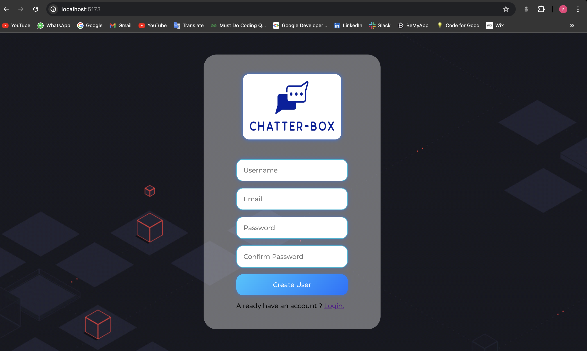
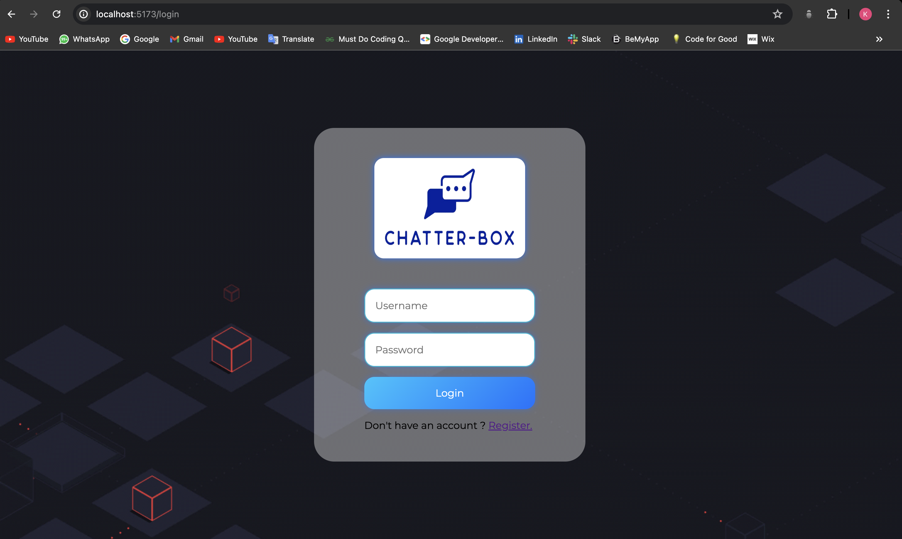
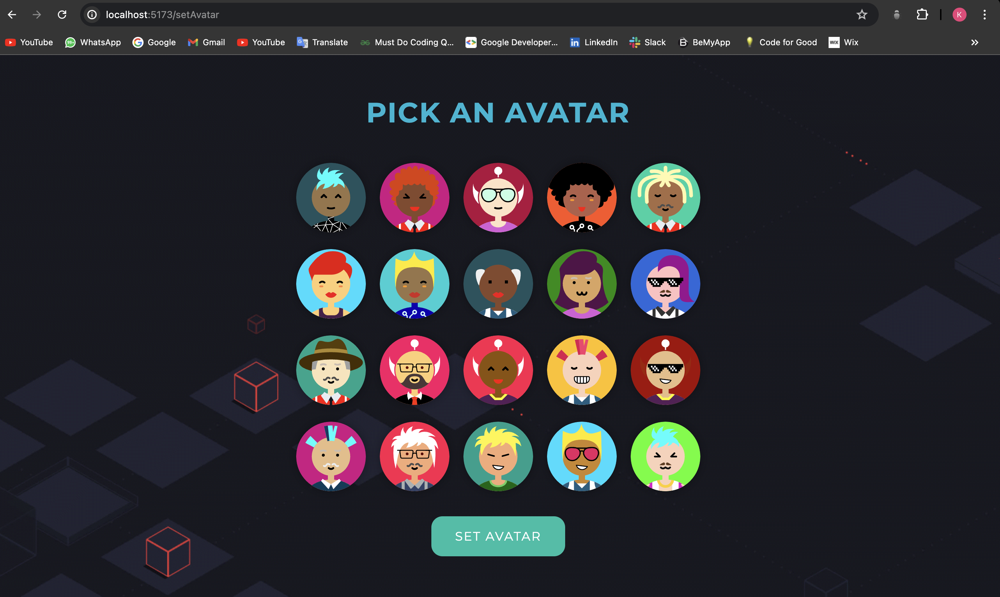
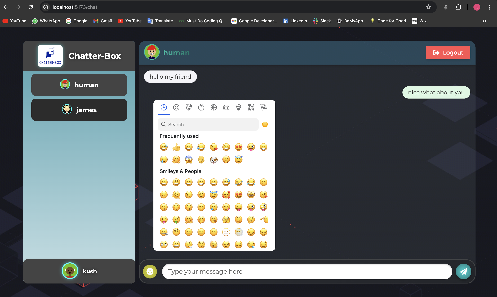

# Chatter-Box

Welcome to **Chatter-Box**, a real-time chat application built with modern technologies. Chatter-Box allows users to connect, chat, and interact with each other in a vibrant and engaging environment.

## 🛠️ Features

- **Real-Time Chatting:** Users can chat in real-time with other users using WebSockets powered by [Socket.IO](https://socket.io/).
- **User Authentication:** Secure user registration and login.
- **Avatar Customization:** Users can set and change their avatar image.
- **Chat Functionality:** Engage in one-on-one chat conversations.
- **MongoDB Integration:** Data is stored and managed using [MongoDB](https://www.mongodb.com/).
- **Responsive Design:** A clean, modern UI designed to work on various devices.

  ## Technologies Used

**Chatter-Box** utilizes a variety of technologies to provide a modern and efficient chat experience. Here’s a breakdown of the technologies used in both the frontend and backend of the application:

### Frontend

- **[React](https://reactjs.org/)**

- **[styled-components](https://styled-components.com/)**

### Backend

- **[Node.js](https://nodejs.org/)**

- **[Express](https://expressjs.com/)**

- **[Socket.IO](https://socket.io/)**

### Database

- **[MongoDB](https://www.mongodb.com/)**


## 🖼️ Screenshots

Here are some screenshots of the Chatter-Box application:






## 🚀 Getting Started

### Prerequisites

To run Chatter-Box locally, you need to have the following installed:

- [Node.js](https://nodejs.org/)
- [npm](https://www.npmjs.com/) or [yarn](https://yarnpkg.com/)
- [MongoDB](https://www.mongodb.com/): Ensure you have MongoDB running locally or have a connection string for a remote MongoDB instance.


## 🌐 API Endpoints

Here are the available API endpoints for Chatter-Box:

- **`POST /`**: Register a new user.

- **`POST /login`**: Log in a user.

- **`POST /setAvatar`**: Set or update the user's avatar.

- **`POST /chat`**: Send a message in the chat.


## 🧪 Testing

To run tests for both frontend and backend:

- **Frontend:**

    ```bash
    cd frontend
    npm run dev
    ```

- **Backend:**

    ```bash
    cd backend
    npm start
    ```


## 📜 Acknowledgments

- [Socket.IO](https://socket.io/) for real-time communication.
- [Emoji Mart](https://github.com/missive/emoji-mart) for the emoji picker.
- [React](https://reactjs.org/) for the frontend framework.
- [Node.js](https://nodejs.org/) and [Express](https://expressjs.com/) for the backend.
- [MongoDB](https://www.mongodb.com/) for the database management.

---

Thank you for checking out Chatter-Box!


